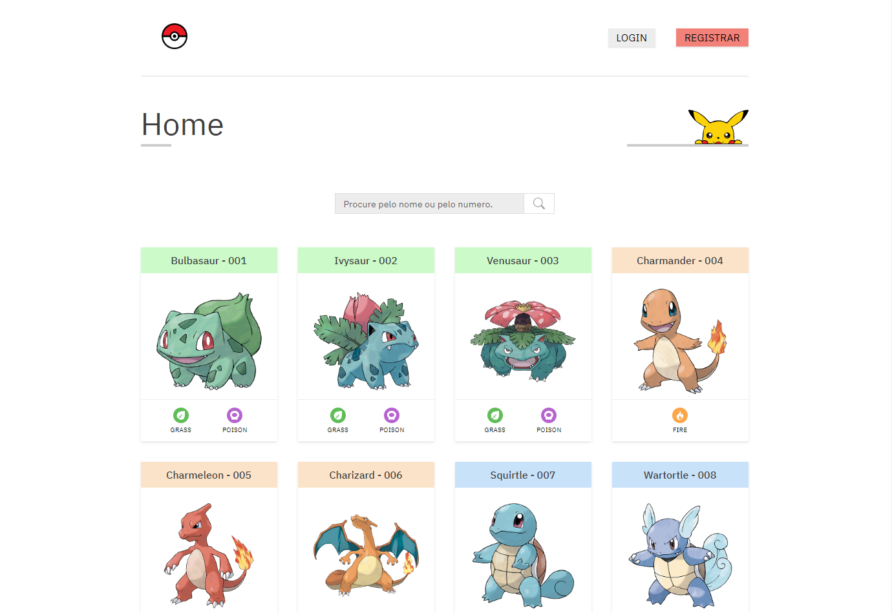

# Pokedex React

O Pokedéx React é uma plataforma onde você pode pesquisar por Pokémons, visualizar seus atributos, tipos e evoluções, além de poder salvar seus Pokémons favoritos para referência futura.

O coração do Pokedéx React é sua integração com a API oficial do Pokémon: https://pokeapi.co. Esta API fornece dados abrangentes sobre cada Pokémon, desde suas características básicas até suas evoluções e habilidades únicas.

Para garantir uma experiência completa, o Pokedéx React foi desenvolvido em conjunto com o projeto Pokedex Server, disponível no repositório [Pokedex Server](https://github.com/thiag-o/pokedex-server). O Pokedex Server gerencia o cadastro de usuários e a funcionalidade de favoritos, permitindo que os usuários salvem e acessem facilmente seus Pokémons preferidos.

Para visualizar os projeto clique aqui: [Pokedex React](https://pokedex-react-tau.vercel.app/)

<h6>** O projeto publicado está sem as funcionalidades de cadastro de usuários e de favoritos, pois a API não está hospedada **</h6>

### Features

- [x] Listagem e filtro de Pokemons
- [x] Criação de conta de usuário
- [x] Salvar e remover Pokemons dos favoritos (precisa estar logado)

### Pokedex API

A Api do projeto está disponível no repositório https://github.com/thiag-o/pokedex-server

## Instalação

<table>
    <tr>
        <th>Dependência</th>
        <th>Versão</th>
    </tr>
    <tr>
        <td>Node</td>
        <td>14.17.0</td>
    </tr>
    <tr>
        <td>Yarn</td>
        <td><a href="https://classic.yarnpkg.com/lang/en/docs/install" target="_blank">Yarn</a></td>
    </tr>
</table>

1. Faça um clone do projeto em sua máquina: `git clone https://github.com/thiag-o/pokedex-react.git`
2. Abra o diretório raíz do projeto `cd pokedex-react`
3. Crie um arquivo `.env` na raíz e adicione o valor para a variável que irá linkar a API conforme o exemplo: `API_URL=http://localhost:3333`
4. Rode o comando `yarn` para instalar as dependências
5. Rode o comando `yarn build` para efetuar a build
6. Agora para iniciar o projeto é só rodar `yarn preview` e clicar aqui: [http://localhost:4173](http://localhost:4173)

## Tecnologias

## Licença

[MIT](https://choosealicense.com/licenses/mit/)
